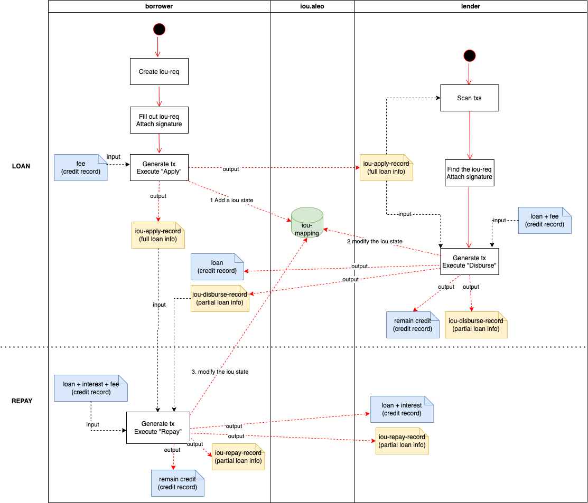

# Iou_v2.aleo

## Summary

Iou_v2 is a peer-to-peer lending contract.</br>

Iou_v2 allows both borrowers and lenders to engage in secure and private loan transactions.

## Loan Process


### Apply
After the borrower and lender agree on the loan terms offline, the borrower initiates the loan by calling the `apply` function. The borrower needs to input the loan information, including:
- Personal information such as wallet addresses, names, and addresses of both parties.
- A signature image provided by the borrower (encoded input).
- Loan details such as the loan amount, currency (currently supporting Aleo credits only), date, repayment deadline, and annual interest rate.

Upon successful invocation, the contract will output loan application records for both the borrower and the lender.

### Disburse
If the lender agrees to the loan, they can call the `disburse` function to make the loan disbursement to the borrower. The lender needs to provide the following information:
- Loan application record.
- Loan amount (Aleo credits) provided by the lender.
- A signature image provided by the lender (encoded input).

Upon successful invocation, the contract will output loan disbursement records for both the borrower and the lender and transfer the loan amount to the borrower. The disbursement records can be used as proof that the lender has made the payment and that the borrower has received the loan.

### Repay
On the agreed repayment date, the borrower calls the `repay` function to repay the loan to the lender. The borrower needs to provide the following information:
- Loan application record.
- Loan disbursement record.
- Repayment details, including the principal and interest (Aleo credits) paid by the borrower.

Upon successful invocation, the contract will output loan repayment records for both the borrower and the lender and transfer the repayment amount to the lender. Similarly, the repayment records can be used as proof that the borrower has completed the repayment and that the lender has received the repayment.

## Some problems
Due to the current limited capabilities of the Leo language, some functions of Iou_v2 have not been completed, and there will be problems in actual operation, including:
- Iou_v2 cannot actually handle the transfer of Aleo credits because other contracts currently cannot manipulate the credits record generated by credits.aleo. In order to write the transfer function of Iou_v2, we define the MockCredits record, which is used to replace the credits record.
- Because the current Leo language does not have a String type, Iou_v2 cannot handle names and addresses. We temporarily use the u64 type to demonstrate the processing logic of data such as names and addresses.
- Iou_v2 needs to encode the signature image and store it on the chain, but there is no way to implement this logic using the Leo language.
We hope that the subsequent updates of the Leo language can help us solve the above problems, or provide other solutions.

## Running the Program

Leo provides users with a command line interface for compiling and running Leo programs.
Users may either specify input values via the command line or provide an input file in `inputs/`.

### Configuring Accounts
The `program.json` file contains a private key and address. 
This is the account that will be used to sign transactions and is checked for record ownership.
When executing programs as different parties, be sure to set the `private_key` and `address` fields in `program.json` to the appropriate values.</br>
See `./run.sh` for an example of how to run the program as different parties.

### Providing inputs via the command line.
1. Run
```bash
leo run <function_name> <input_1> <input_2> ...
```
See `./run.sh` for an example.


### Using an input file.
1. Modify `inputs/iou_v2.in` with the desired inputs.
2. Run
```bash
leo run <function_name>
```